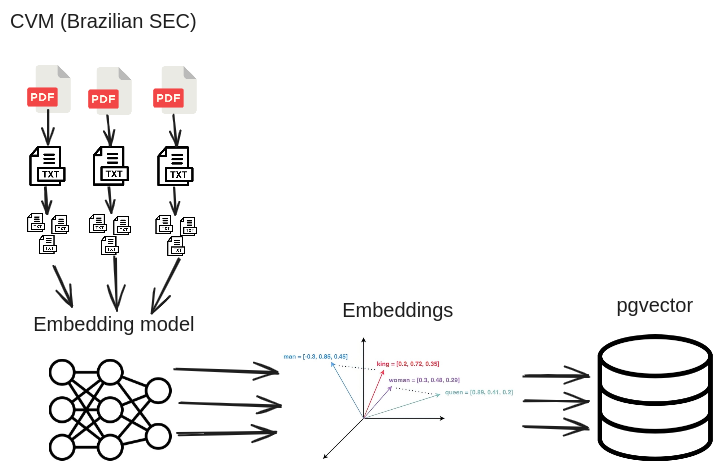
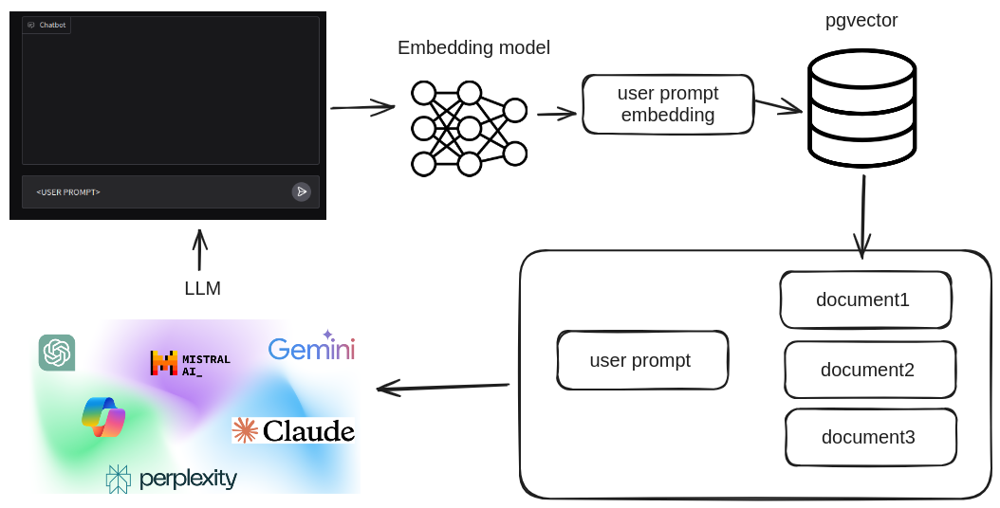

# Project

This project combines Large Language Models (LLM) with Retrieval-Augmented Generation (RAG) to efficiently answer queries about public Brazilian companies. I’ve used PostgreSQL to store structured company data, with pgvector enabling fast vector search for document retrieval.

For natural language processing, I used the Google Gemini Flash model and Hugging Face models to generate embeddings. User queries are handled through an interactive Gradio interface, while Polars was employed for high-performance data manipulation and analysis.

By integrating these technologies, the system retrieves relevant documents from the Securities and Exchange Commission of Brazil and generates accurate responses, making it easier to access corporate data in Brazil.

# Diagrams

## Preprocessing



## Chatbot



# Models

- Embeddings: [paraphrase-multilingual-MiniLM-L12-v2](https://huggingface.co/sentence-transformers/paraphrase-multilingual-MiniLM-L12-v2)
- Large Language Model: [gemini-1.5-flash](https://ai.google.dev/gemini-api/docs/models/gemini#gemini-1.5-flash)


# Install
```
poetry install
```

# Running

```
poetry shell
python app.py
```


# Docs

To build the docs using Sphinx, use the following commands:

```
cd docs/
make clean html
cd build/html
python -m http.server
```


# Tests

```
poetry run pytest
```
